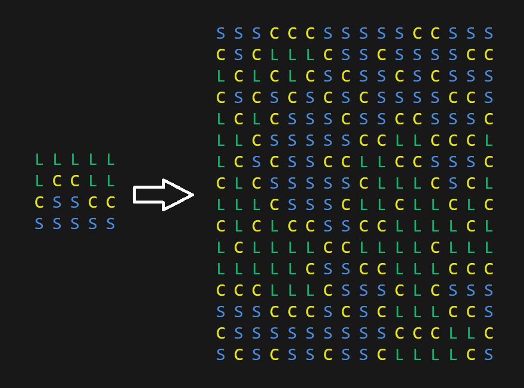

# wfc-learn


Learning about the Wave Function Collapse algorithm.

## References

- Robert Heaton's blog post: [Link](https://robertheaton.com/2018/12/17/wavefunction-collapse-algorithm/)
- The original repo: [Link](https://github.com/mxgmn/WaveFunctionCollapse)

### How to run


First build the project with the following command:
```bash
make
```

Then
```bash
./wfc <input_file> <mode>
```

Mode can be one of the following:
- WEIGHTED: The algorithm will consider the weights of the tiles equal to the total count in the sample.
- CONSTANT: The algorithm will consider the weights of the tiles equal to 1.

To build run everything in one go you can do
```bash
make && ./wfc inputs/world.txt CONSTANT
```

